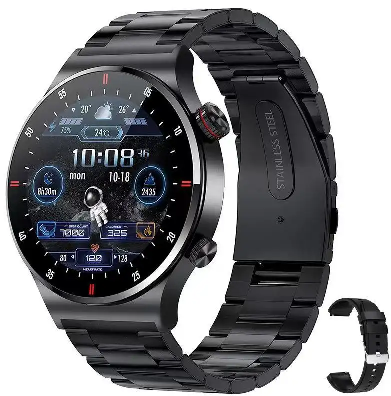
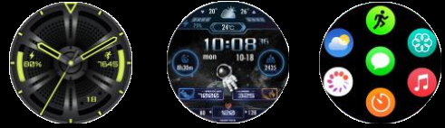

# QW33 Smartwatch — Hardware & Firmware Research

> Personal reverse engineering project: QW33 smartwatch fishing companion mod.
> All research performed on personally owned hardware for personal modification purposes.
> NOT ALL INFORMATION CAPTURED IS CORRECT - [WIP]

---

## Table of Contents

1. [Device Overview](#1-device-overview)
2. [Hardware](#2-hardware)
3. [Software Stack](#3-software-stack)
4. [Firmware Acquisition](#4-firmware-acquisition)
5. [Firmware Analysis — update.ufw](#5-firmware-analysis--updateufw)
6. [Resource System — res.ori](#6-resource-system--resori)
7. [Watch Face Format](#7-watch-face-format)
8. [Companion App Analysis](#8-companion-app-analysis)
9. [API Endpoints](#9-api-endpoints)
10. [BLE Protocol](#10-ble-protocol)
11. [Key Discoveries](#11-key-discoveries)
12. [Development Roadmap](#12-development-roadmap)
13. [Tools & References](#13-tools--references)

---

## 1. Device Overview

| Field | Value |
|-------|-------|
| Model | QW33 (Olevs rebrand, sold under multiple names) |
| Screen | 1.28" IPS Round, 150×150 pixels |
| OS | FunOS Sakura 2.13 |
| Firmware | XM121 V3.1_QW33J_V0.1.3 |
| Companion App | FunDo Health v8.0.0 |
| App Package | `com.cqkct.fundo.health` |
| App Version Code | 895 |
| Platform Code | 2498 |
| BLE Device Name | QW33 / QW33Audio |
| BLE MAC | 7F:XX:5A:XX:58:XX |



---

## 2. Hardware

### Main SoC

| Field | Value |
|-------|-------|
| Chip | JieLi JL7012F6 |
| Chip Family | AC695x / AC695N_watch |
| Architecture | JieLi proprietary DSP (not ARM, not Linux) |
| SDK | JieLi SDK (JLBTSDK, JLAISDK, JLUFW) |
| USB IDs | pid=130, vid=1494 |
| uBoot Version | 1.11.3.4 |

> **Note:** The JL7012F6 is also referred to as AC7012 / AC701 family in some documentation.
> Datasheet: https://www.lcsc.com/datasheet/lcsc_datasheet_2306281529_JieLi-Tech-JL7012F6_C7434396.pdf

### Flash Memory

| Field | Value |
|-------|-------|
| Chip | Boya BY25Q64ASWIG |
| Capacity | 64 Mbit (8 MB) |
| Interface | SPI |
| Package | SOIC-8 (clip-readable without desoldering) |

### Peripherals

| Hardware | Present |
|----------|---------|
| Bluetooth | ✓ (JieLi RCSP protocol) |
| Touchscreen | ✓ |
| Speaker | ✓ |
| Microphone | ✓ |
| LiPo Battery | ✓ |
| Magnetic Charging | ✓ |
| GPS | ✗ (not present) |
| Android / Wear OS | ✗ (not applicable) |

---

## 3. Software Stack

```
┌─────────────────────────────────┐
│  FunOS Sakura 2.13              │  UI / Application layer
├─────────────────────────────────┤
│  JieLi SDK                      │  JLBTSDK + JLAISDK + JLUFW
│  (JLBTSDK / JLAISDK / JLUFW)   │
├─────────────────────────────────┤
│  JL7012F6 DSP Core              │  Hardware
└─────────────────────────────────┘
```

FunOS is **not Linux** — it is a proprietary RTOS built on top of the JieLi SDK running directly on the JL7012F6 DSP. The UI is entirely resource-driven (see Section 6).

---

## 4. Firmware Acquisition

### Method

Firmware was obtained through a multi-step process:

**Step 1 — Phone logcat (real device)**
Connected the real phone with watch paired via ADB. Used `adb logcat | findstr fota` to capture the live FOTA API request made by FunDo Health when checking for updates. This revealed the signed endpoint at `https://api.cqkct.com/uniapi/fundo_versions/fota` with all query parameters including `adaptiveNumber=2498` and `deviceVersion=v0.1.3`.

**Step 2 — Auth failed**
Attempts to replay or spoof the signed request failed. The `sign` parameter is a SHA1-based HMAC tied to the timestamp and all query parameters. The signing secret (`appSecret=wwt` from AndroidManifest) was identified but the exact signing algorithm construction could not be fully reversed from static analysis alone. Replaying with a lower `deviceVersion` was therefore not possible without a valid sign.

**Step 3 — DEX dump on emulator**
FunDo Health APK is protected by 360jiagu packer — the real application DEX is encrypted at rest. To access the real code, the app was run on LDPlayer (x86_64 Android emulator) with root and SELinux disabled. `frida-dexdump` was used to dump 12 DEX files (44 MB total) from process memory after the jiagu runtime decrypted them.

**Step 4 — Static analysis of decrypted DEX**
Strings were extracted from `classes07.dex`. A hardcoded test server URL was found:
```
https://test02.jieliapp.com/health/2021/03/30/upgrade.zip
```

**Step 5 — Direct download**
`upgrade.zip` was downloaded directly from the test server URL — no authentication required. The package contained the complete firmware image and all watch face resources.

### OTA Delivery Chain

```
Real phone + ADB logcat
  └─ Captured signed FOTA API request
       └─ Sign algorithm not fully reversible → dead end

Real phone + Frida
  └─ frida-dexdump → 12 decrypted DEX files (44 MB)
       └─ classes07.dex → hardcoded test URL found
            └─ https://test02.jieliapp.com/health/2021/03/30/upgrade.zip
                 └─ Direct download → upgrade.zip (no auth required)
```

### OTA Request Parameters

| Parameter | Value |
|-----------|-------|
| Server | `http://test03.jieliapp.com` |
| Endpoint | `/health/v1/api/watch/ota/version/newbypidvid` |
| Method | POST (JSON body) |
| authKey | `hE9yfseX6UdK7rFh` |
| projectCode | `jl_v8` |
| pid | 130 |
| vid | 1494 |
| versionCode | 0 |
| versionName | V_0.0.0.0 |

### Package Contents

```
upgrade.zip
├─ update.ufw          3,716,032 bytes  JieLi firmware image
└─ res.ori/
   ├─ JL              1,714,880 bytes  Main UI resources
   ├─ font              311,152 bytes  ASCII + GB2312 bitmap fonts
   ├─ watch             529,312 bytes  Default watch face (face 0)
   ├─ watch1            117,456 bytes  Watch face 1
   ├─ watch2             53,872 bytes  Watch face 2
   ├─ watch3             62,704 bytes  Watch face 3
   ├─ watch4             73,232 bytes  Watch face 4
   └─ watch5             43,728 bytes  Watch face 5
```

---

## 5. Firmware Analysis — update.ufw

### Format

The `.ufw` file is a **proprietary JieLi firmware container** — not ELF, not ZIP, not Android, not Linux. It contains compiled JieLi SDK firmware for the JL7012F6 DSP core.

### Key Strings Found

**JieLi SDK references:**
- `JLBTSDK`
- `JLAISDK`
- `JL_AI_UBOOTH`
- `JLUFW`

**OTA binary references (update modes):**
- `ble_ota.bin` — BLE OTA update
- `ble_app_ota.bin` — BLE application OTA
- `uart_update.bin` — UART update
- `sd_update2.bin` — SD card update
- `usb_update2.bin` — USB update
- `edr_ota2.bin` — EDR OTA

**Chip family references:**
- `AC695x`
- `AC695N_watch`

**Hardware init:**
- `spi_open`, `spi_init`, `lcd_dev_init`
- `UPDATE_JUMP`, `EX_FLASH`
- `PB07_2A_PB11` (GPIO pin references)

**Internal filesystem files referenced:**
- `WATCH1` through `WATCH6`
- `WMEM.BIN`

### Conclusion

The firmware is a monolithic JieLi SDK binary. It is not patchable without the JieLi SDK toolchain and chip-specific build environment. However, the **UI layer is entirely separate** (in `res.ori/`) and can be modified without touching the firmware binary.

---

## 6. Resource System — res.ori

### JLFS Container Format

Each file in `res.ori/` is a JieLi File System (JLFS) container. The format is documented at https://kagaimiq.github.io/jielie/

**File index entry structure (32 bytes each):**

```c
struct jlfs_entry {
    uint16_t  hdr_crc;    // CRC16 of header
    uint16_t  data_crc;   // CRC16 of data
    uint32_t  offset;     // Absolute data offset within container
    uint32_t  size;       // File data size in bytes
    uint8_t   attr;       // 0x02 = file, 0x03 = container root
    uint8_t   reserved;
    uint16_t  index;      // 0 = more entries, non-zero = last entry
    char      name[16];   // Null-terminated filename
};
```

**Container header:** 32 bytes at offset 0x00, followed by index entries at 0x20 onwards.

**Flag values:**
- `0x0000FF02` = file entry
- `0x0000FF03` = container root

### Container Contents

#### JL (Main UI — 1.7 MB)
Internal files: `JL.sty`, `JL.res`, `JL.str`
- Main application UI styles, images, and strings
- Contains global widget definitions shared across all watch faces

#### font (311 KB)
Internal files: `F_ASCII.PIX`, `F_GB2312.PIX`, `F_GB2312.TAB`
- Bitmap font data for ASCII and Chinese GB2312 characters
- `.PIX` = pixel bitmap data, `.TAB` = character index table

#### watch / watch1–5 (Watch Faces)

Each watch face container holds:

| File | Size (watch) | Purpose |
|------|-------------|---------|
| `watch.json` | 32 bytes | Version tag only: `{"version_id": "W001"}` |
| `watch.view` | 24,912 bytes | Binary widget layout (magic: `RU21`) |
| `watch.sty` | 736 bytes | Widget style definitions, format strings |
| `watch.res` | 292,793 bytes | Image resources (backgrounds, digit sprites, icons) |
| `watch.str` | 28 bytes | String table |
| `watch.anim` | 210,259 bytes | Animation sequences (default face only) |
| `watch.tab` | 98 bytes | Data lookup tables (default face only) |

**Watch face screen dimensions (from .view headers):**

| Face | Dimensions |
|------|-----------|
| watch | 150×150 |
| watch1 | 183×183 |
| watch2 | 154×154 |
| watch3 | 141×141 |
| watch4 | 140×140 |
| watch5 | 143×144 |

---

## 7. Watch Face Format

### .view File (Binary Widget Layout)

**Header (offset 0x00, 48 bytes):**

```
[0x00]  char[4]   magic = "RU21"
[0x04]  uint8[4]  version flags = 01 01 01 00
[0x08]  uint32    value = 1
[0x0C]  uint32    checksum/timestamp
[0x10]  uint32    reserved = 0
[0x14]  uint32    header size = 0x18 (24 bytes)
[0x18]  uint32    widget section offset
[0x1C]  uint16    = 1
[0x1E]  uint16    = 0x54
```

**Display descriptor (offset 0x30):**

```
[0x30]  uint16    colour depth = 0x0100 (256 colours, 8bpp palette)
[0x34]  uint16    = 0x0050
[0x38]  uint32    palette size = 0x0400 (1024 bytes = 256 × 4 byte RGBA)
[0x3C]  uint32    palette CRC
[0x44]  uint16    screen width  (pixels)
[0x46]  uint16    screen height (pixels)
[0x48]  uint16    widget data offset
[0x4C]  uint16    widget section size
[0x50]  uint32    section magic = 0x0055AAA5
```

**Palette:** 1024 bytes (256 × RGBA) follows the display descriptor

**Widget section:** at offset specified by `[0x48]`, fixed size 1104 bytes

### .sty File (Widget Style Definitions)

Widget records are variable length. Each record contains:

```
[offset-16]  uint32  next_record_offset
[offset-12]  uint16  widget_id
[offset-10]  uint16  flags
[offset-8]   uint32  colour (0x00RRGGBB)
[offset-4]   uint32  data_block_offset
[offset]     char[]  widget_type_name (null-terminated)
[...]        char[]  format_string (null-terminated)
[...]        bytes   additional parameters
```

**Supported widget types discovered:**

| Type | Description | Format Example |
|------|-------------|----------------|
| `rtc` | Real-time clock | `h:m:s` |
| `strpic` | String-to-sprite (digit images) | `%02d:%02d` |
| `text` | Text label | — |
| `ascii` | ASCII text renderer | — |
| `numb` | Numeric display | `%d`, `%03d` |
| `mulstr` | Multi-string (value-indexed) | — |
| `time1` / `time2` | Named time fields | `M/D`, `m:s` |
| `dis_str` | Display string | — |

### .res File (Image Resources)

Contains packed image data for:
- Watch face backgrounds
- Digit sprite sheets (0–9 for time/date display)
- Icons (battery, heart rate, steps, etc.)
- Animation frames

Format: JieLi proprietary image container (palette-indexed, 8bpp).
The `BmpConvert` tool from the JieLi Android Health SDK converts standard images to this format.

---

## 8. Companion App Analysis

### FunDo Health v8.0.0

| Field | Value |
|-------|-------|
| Package | `com.cqkct.fundo.health` |
| Version | 8.0.0 (code 895) |
| Protection | 360jiagu packer (DEX encrypted at rest) |
| appKey | `190528yXO` |
| appSecret | `wwt` (from AndroidManifest meta-data) |

### Key Libraries (from APK native libs)

| Library | Purpose |
|---------|---------|
| `libKCTCommand.so` | BLE command encoding/decoding |
| `libjl_ota_auth.so` | JieLi OTA authentication |
| `libjl_pack_format.so` | JieLi package format handling |
| `libjiagu.so` | 360jiagu DEX encryption runtime |

### Key Classes (from DEX dump via Frida)

| Class | Purpose |
|-------|---------|
| `JLOtaController` | Manages full OTA update process |
| `JLDfuCallback` | DFU update callbacks |
| `JLCustomWatchFaceController` | Watch face push to device |
| `FotaController` / `FotaOperator` | FOTA update management |
| `JLCustomAlarm` | Alarm sync via BLE |
| `WatchManager` | Top-level watch management |

### DEX Dump Method

DEX was decrypted and dumped using `frida-dexdump` while the app ran on LDPlayer (x86_64 Android emulator). The 360jiagu packer decrypts the real DEX into memory at runtime — Frida hooks the process after decryption and dumps all 12 DEX files (total ~44 MB of real application code).

---

## 9. API Endpoints

### Primary API (cqkct.com)

Base URLs:
- `https://api.cqkct.com`
- `https://api.cqkct.top`

Query signature: SHA1-based, parameters include `appKey`, `timestamp`, `sign`. Signing algorithm uses a secret derived from `appSecret=wwt` but the exact construction was not fully reversed.

| Endpoint | Purpose |
|----------|---------|
| `uniapi/fundo_versions/fota` | Firmware version check (signed GET) |
| `uniapi/dfu/uri` | DFU firmware download URI |
| `uniapi/new_dial/download` | Watch face download |
| `uniapi/new_dial/raw4` | Watch face raw format |
| `uniapi/agps/uri` | AGPS data |
| `uniapi/sdk/authorized` | SDK authorisation |

### Legacy FOTA (plain HTTP, no auth)

```
http://app.fundo.xyz:8001/version/api/version.php?type=fota&flag=2&model=QW33J
```
Returns `2` (no update found) for model `QW33` and `QW33J`. Returns `DATA_NOT_EXIST` when called with a valid signed request — firmware record not found for `adaptiveNumber=2498` on this server.

### FunOS Event Server

```
https://api.funos.cn/deviceEvent/save
```
Device bind/event logging. Confirmed active from device log capture.

### JieLi Health Server (OTA)

```
http://test03.jieliapp.com/health/v1/api/watch/ota/version/newbypidvid
```
POST endpoint. Returns firmware download URL for `pid=130, vid=1494`. Requires auth token from JieLi health account — not tested with full auth.

---

## 10. BLE Protocol

### Protocol Stack

The QW33 uses the **JieLi RCSP (Remote Control Serial Protocol)** over BLE.

```
Application layer  →  JieLi RCSP commands
Transport layer    →  BLE GATT (custom service/characteristic UUIDs)
Physical layer     →  Bluetooth 5.0 LE
```

### Key Parameters

| Parameter | Value |
|-----------|-------|
| MTU | 247 bytes (negotiated for faster transfer) |
| Watch face slots | 3 slots available |
| OTA auth key | `hE9yfseX6UdK7rFh` |
| OTA project code | `jl_v8` |

### Open Source SDK

JieLi publishes the full RCSP SDK under Apache 2.0:
- Android: https://gitee.com/Jieli-Tech/Android-JL_Bluetooth
- Android Health: https://gitee.com/Jieli-Tech/Android-JL_Health
- iOS: https://gitee.com/Jieli-Tech (iOS equivalent)
- OTA: https://gitee.com/Jieli-Tech/Android-JL_OTA

The `Android-JL_Health` SDK includes `JLCustomWatchFaceController` which handles the full watch face push pipeline over BLE.

---

## 11. Key Discoveries

### FunOS is Resource-Driven

The most important finding of this research: **FunOS does not need to be modified to customise the watch face.** The entire UI layer is driven by the resource files in `res.ori/`. Replacing or modifying these files changes the watch face without touching the firmware binary.

Custom watch faces are achievable by:
- Defining widget layout in `.view` format
- Creating image assets in `.res` format
- Writing style rules in `.sty`
- Packaging into JLFS container format
- Pushing via the JieLi Health SDK (`JLCustomWatchFaceController`)

### Community Tools

The XDA/GitHub community has independently discovered the same architecture for the HK89 (JL7012) watch family:

- **MiguelDLM/smart_watch** — Open source companion app + web watch face designer
  - https://github.com/MiguelDLM/smart_watch
  - Web designer: https://migueldlm.github.io/smart_watch/
  - Note: QW33 uses FunOS variant, slightly different from HK89/CoFit format

- **kagaimiq/jielie** — Comprehensive JieLi reverse engineering documentation
  - JLFS format fully documented
  - uboot flash tool: https://github.com/kagaimiq/jl-uboot-tool

- **GZHXXY/6.12_test** — JieLi BR28 SDK including UITools (official JieLi GUI builder)
  - `cpu/br28/tools/UI工程/UITools`

- **zzuler** (XDA) — hkdecom decomp/recomp tool for JL7012 `.bin` watch faces
  - Python scripts for extracting and reconstructing dial files

### JL7012 Chip Identity

The JL7012F6 is confirmed to be the same silicon as AC7012 / AC701 family. The chip family is AC695x in JieLi's internal naming. The `AC695N_watch` string found in the firmware confirms the watch-specific build variant.

---

## 12. Development Roadmap

### Phase 1 — Custom Watch Face (current)
- [x] Firmware package obtained
- [x] Resource system understood
- [x] JLFS container format decoded
- [x] Widget types identified
- [ ] `.view` binary format fully decoded
- [ ] `.res` image format decoded
- [ ] Fishing watch face designed
- [ ] Watch face packaged and pushed to device

### Phase 2 — BLE Protocol
- [x] Protocol identified (JieLi RCSP)
- [x] Open source SDK found (Jieli-Tech/Android-JL_Health)
- [ ] Custom commands documented
- [ ] Data push tested (time, weather, custom fields)
- [ ] Button press capture tested

### Phase 3 — Companion App
- [ ] Android app with BLE manager
- [ ] Solunar calculation engine
- [ ] GPS waypoint marking
- [ ] Weather API integration
- [ ] Fishing log (SQLite)
- [ ] Live data push to watch face

### Phase 4 — Optional: Firmware Research
- [ ] SPI flash dump (CH341A + SOIC-8 clip)
- [ ] update.ufw structure analysis
- [ ] JieLi SDK build environment setup
- [ ] Custom firmware build (high risk, low priority)

---

## 13. Tools & References

### Tools Used

| Tool | Purpose |
|------|---------|
| `adb` | Android device communication |
| `frida` 17.10.1 | Runtime instrumentation |
| `frida-dexdump` | DEX extraction from running process |
| `androguard` | APK/DEX static analysis |
| LDPlayer (x86_64) | Android emulator for app analysis |

### Key References

| Resource | URL |
|----------|-----|
| JieLi chip datasheet | https://www.lcsc.com/datasheet/lcsc_datasheet_2306281529_JieLi-Tech-JL7012F6_C7434396.pdf |
| kagaimiq/jielie RE docs | https://kagaimiq.github.io/jielie/ |
| kagaimiq/jl-uboot-tool | https://github.com/kagaimiq/jl-misctools/tree/main/firmware |
| Jieli-Tech Android Health SDK | https://gitee.com/Jieli-Tech/Android-JL_Health |
| Jieli-Tech Android BT SDK | https://gitee.com/Jieli-Tech/Android-JL_Bluetooth |
| MiguelDLM/smart_watch | https://github.com/MiguelDLM/smart_watch |
| GZHXXY/6.12_test (UITools) | https://github.com/GZHXXY/6.12_test/tree/master/cpu/br28/tools |
| XDA JL7012 thread | https://xdaforums.com/t/hk89-hk26-smartwatch-and-maybe-other-watches-made-with-jl7012-cpu.4616517/ |
| XDA Dial Studio thread | https://xdaforums.com/t/app-tool-open-source-watch-companion-watch-face-designer-for-jieli-hk89-jl7012-smartwatches-rebranded-clones.4790357/ |

---

*QW33 Fishing Mod Project — Personal research document*

---

## 14. Known Firmware URLs

These URLs were found by static analysis of the DEX files dumped from the FunDo Health app:

| URL | Source | Notes |
|-----|--------|-------|
| `https://test02.jieliapp.com/health/2021/03/30/upgrade.zip` | `classes07.dex` | Hardcoded test firmware URL |
| `http://test03.jieliapp.com/health/v1/api/watch/ota/version/newbypidvid` | Runtime intercept | Active OTA endpoint (POST) |
| `http://app.fundo.xyz:8001/version/api/version.php` | `libKCTCommand.so` | Legacy FOTA check |
| `https://api.cqkct.com/uniapi/fundo_versions/fota` | Runtime logcat | Primary FOTA check (signed) |

The `upgrade.zip` at `test02.jieliapp.com` is a **direct download link** — no authentication required. This is the same package format as our captured firmware and likely an older build. It can be downloaded directly:

```bash
curl -O https://test02.jieliapp.com/health/2021/03/30/upgrade.zip
```

Related strings found alongside this URL in `classes07.dex`:
- `CMD_GET_DEV_MD5` — command to read MD5 of firmware on device
- `GetDevMD5Cmd` — class implementing the MD5 verification command
- `output.zip` — intermediate output filename during OTA process

---
*QW33 Fishing Mod Project — Personal research document* [Ongoing]
